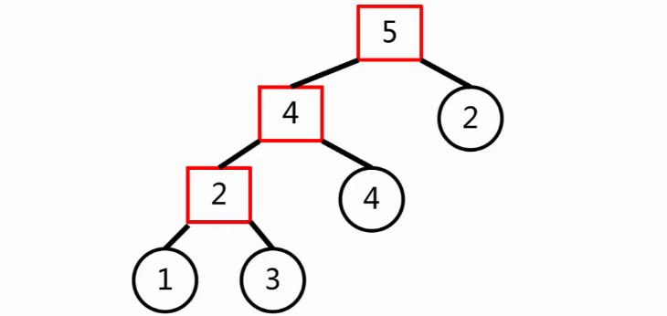

# 算法

## 最小生成树 MST

最小生成树，即**边权和最小的生成树**。

### ~~Prim~~

时间紧迫，先不学了。

### Kruskal

为了造出一棵最小生成树，我们从最小边权的边开始，按边权从小到大依次加入，如果某次加边产生了环，就扔掉这条边，直到加入了 $n - 1$ 条边，即形成了一棵树。

[P3366 【模板】最小生成树](https://www.luogu.com.cn/problem/P3366)

```cpp
void kruskal(){
	sort(e + 1, e + m + 1, cmp); //按边权排序
	for(int i = 1; i <= m; i++){
		int u = f(e[i].u), v = f(e[i].v); 
		if(u == v) continue; //如果连通则不对最小生成树产生贡献，忽略
		ans += e[i].w; 
		unity(u, v); //并入同一集合
		cnt++;
		if(cnt == n - 1) break;
	}
}
```

#### 例一 [HDU7226](https://acm.hdu.edu.cn/showproblem.php?pid=7226)

边的上界小于 $n$。

建图，最小生成树。

边权值域小，可以使用桶排去掉 $log(n)$。复杂度 $O(n)$。


#### 例二 [P2245 星际导航](https://www.luogu.com.cn/problem/P2245)

找一条路径上边权的最大值。

1. 用 Kruskal 建最小生成树。对于每个询问跑 LCA 。

2. **Kruskal 重构树** 可以维护最小生成树上**最大边权**的问题。

   首先将所有边按边权从大到小排序。

   从最小边开始。如果这条边的两个邻接点在同一个集合中，跳过；否则，建立一个虚点作为这两个点共同的祖先，让这个虚点的点权等于这条边的边权。

   如此操作 $n - 1$ 次，就可以得到一个恰好有 $n$ 个叶子的二叉树，每个非叶子节点刚好有两个儿子。这棵树就是 Kruskal 重构树。

   


#### 例三 [P2619 [国家集训队] Tree I](https://www.luogu.com.cn/problem/P2619)

一种假解法：朴素贪心。对全部边进行排序，有白选白，直接选择 $need$ 条白边。这样选择的话，生成树权值不为最小，会漏选更小权值的黑边。

正解：带权二分。

#### 例四 [P4180 [BJWC2010] 严格次小生成树](https://www.luogu.com.cn/problem/P4180)

用 LCA 维护最小值和次大值。

#### 例五 [POJ2728 Desert King](http://poj.org/problem?id=2728)

最优比率生成树。

给定 $n$ 个点的一个无向图，图中每对顶点间的边 $e$ 有一个收益 $C_e$ 和一个成本 $R_e$。求该图的一个生成树 $T$。$n <= 1000$。

0-1分数规划问题。[分数规划 - OI Wiki](https://oi-wiki.org/misc/frac-programming/)

可以用二分答案解决。

## 连通性问题 Tarjan算法

#### 例一 [P1656 炸铁路](https://www.luogu.com.cn/problem/P1656)

```cpp
struct ANS{
	int a, b;
} ans[N];
int anscnt;
int dfn[N], low[N], dfsclock;
void tarjan(int x, int diff){
	low[x] = dfn[x] = ++dfsclock;
	for(int i = head[x]; i; i = edge[i].next){
		if(i == (diff ^ 1)) continue;
		int y = edge[i].to;
		if(!dfn[y]){
			tarjan(y, i);
			low[x] = min(low[x], low[y]);
			if(low[y] > dfn[x]){
				ans[++anscnt].a = x;
				ans[anscnt].b = y;
			}
		} else low[x] = min(low[x], dfn[y]); //这里的 dfn[y] 可以换成 low[y]
	}
}
```

#### 例二 [P2227 [HNOI2001] 洗牌机](https://www.luogu.com.cn/problem/P2227)


## 并查集

例题 [P1536 村村通](https://www.luogu.com.cn/problem/P1536)

并查集是一种树型数据结构，用来处理一些不相交集合的**合并和查询**问题。可以用来判断一个森林里有几棵树、某个节点是否属于某个数，等等。

代码实现：

```cpp
int fa[N], n, m, x, y;
//find:确定元素属于哪一个子集。它可以被用来确定两个元素是否属于同一子集。
int find(int x){
	if(x != fa[x])
		fa[x] = find(fa[x]); // 路径压缩，使祖先下的子节点尽可能多，优化find速度
	return fa[x]; //返回祖先
}
//unity:将两个子集合并成一个集合。
void unity(int x, int y){
	int r1 = find(x);
	int r2 = find(y);
	fa[r1] = r2; //合并祖先
}
int main(){
    cin >> n;
    cin >> m;
    for(int i = 1; i <= n; i++) //init
    	fa[i] = i;
    for(int i = 1; i <= m; i++){
    	cin >> x >> y;
    	unity(x, y);
	}
    return 0;
}
```

另一种 `find()` 的写法：

```cpp
int find(int x) {
    return x == fa[x] ? x : fa[x] = find(fa[x]);
}
```

# 模拟赛 图论专项（二）

$$10 /400$$

## T1 [P7991 [USACO21DEC] Connecting Two Barns S](https://www.luogu.com.cn/problem/P7991)

用**并查集**维护不加边时会有几个连通块、每个点在哪一个连通块。用 $f_i$ 来表示 $i$ 所在的连通块的代表点。代表点即为这个连通块在并查集中的祖先。

如果只有一个连通块，那么`ans = 0`；如果有两个连通块，那么`ans = 1`；

如果有大于两个连通块，那么题目将被转化为，通过除了 $f_i$ 和 $f_n$ 的某一个连通块来连接。对于每一个连通块 $f_i$，计算其最小代价，维护 `ans`。

可以用二分答案优化。对于每一个点 $i$，`upper_bound` 查找 $f_1$ 与 $f_n$ 中离点 $i$ 最近的点，然后分别遍历连通块中的点，维护最小值。

[Complete Code](https://www.luogu.com.cn/record/190698478)

## T2 [P8191 [USACO22FEB] Moo Network G](https://www.luogu.com.cn/problem/P8191)

观察到 $1 <= y <= 10$，暴力建边 + Kruskal。

[Complete Code](https://www.luogu.com.cn/record/190726088)

## T3 [P7528 [USACO21OPEN] Portals G](https://www.luogu.com.cn/problem/P7528)

## T4 [P8328 [COCI2021-2022#5] Usmjeravanje](https://www.luogu.com.cn/problem/P8328)

# 参考

[hdu7226 - qwq_123](https://www.cnblogs.com/qwq-123/p/16596066.html)

[最小生成树 - OI Wiki](https://oi-wiki.org/graph/mst/)

[[图论 —— 生成树 - Alex_McAvoy](https://blog.csdn.net/u011815404/article/details/84070642)](https://blog.csdn.net/u011815404/article/details/88625346)

[P7991 [USACO21DEC] Connecting Two Barns S题解 - 洛谷专栏 (luogu.com.cn)](https://www.luogu.com.cn/article/5xh6mqw6)

[洛谷P7991题解 - Ginger_he](https://www.luogu.com.cn/article/gk8grpa9)

[并查集 - OI Wiki](https://oi-wiki.org/ds/dsu/)

[【算法与数据结构】—— 并查集 - theSerein](https://blog.csdn.net/the_zed/article/details/105126583)

[题解 P1536 【村村通】 - Strong_Jelly](https://www.luogu.com.cn/article/dvxfc9qa)

[P7991 题解 - 望月Asta](https://www.luogu.com.cn/article/ohcq9kwt)
